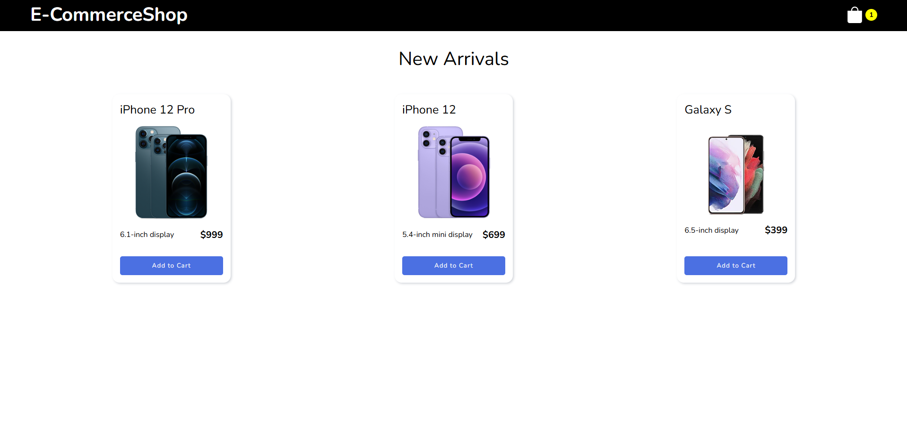

# E-CommerceShop

A simple e-commerce shop built with React, Redux Toolkit (RTK Query) and an Express backend. Browse products, add them to the cart, change quantities and see the subtotal update.



## Tech stack

- **Frontend:** React 17, Redux Toolkit, RTK Query, React Router 6, React Toastify
- **Backend:** Node.js, Express, CORS

## Getting started

Requires Node.js 18 or newer.

**1. Start the backend** (runs on http://localhost:5000)

```bash
cd backend
npm install
npm start
```

**2. Start the frontend** (runs on http://localhost:3000)

```bash
cd frontend
npm install
npm start
```

Start the backend first, because the frontend loads its products from `http://localhost:5000/products`.

## API

| Method | Endpoint    | Description          |
| ------ | ----------- | -------------------- |
| GET    | `/`         | Welcome message      |
| GET    | `/products` | List of all products |
